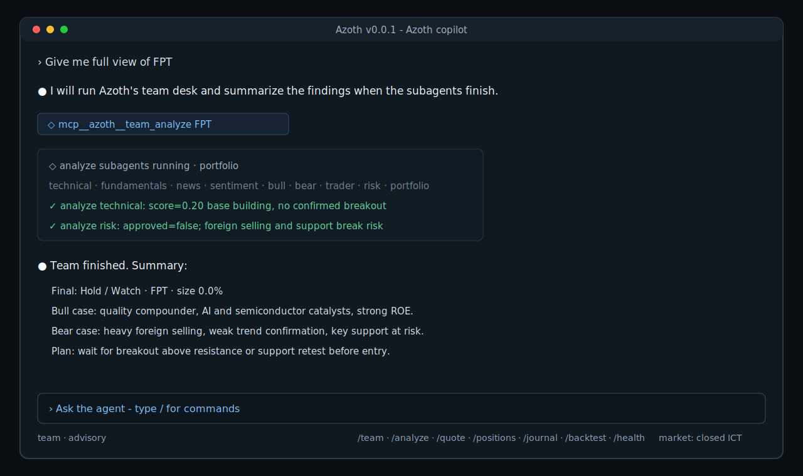

# Azoth

Azoth is a professional agent CLI for Vietnam equity research, portfolio
workflow, and broker-aware trading operations.



It combines an interactive terminal UI, Claude Agent SDK orchestration,
market-data tools, multi-agent research, local journaling, paper trading,
backtesting, and optional DNSE Entrade X live broker integration. Azoth is
designed for disciplined decision support: every recommendation should be
grounded in tool output, written to a journal, and constrained by explicit
autonomy and risk settings.

> Azoth is investment software, not financial advice. Live trading can place
> real orders against a real account. Use advisory or paper mode until you have
> verified configuration, data quality, account state, and risk limits.

Latest release: [v0.0.1](docs/releases/v0.0.1.md)

## Highlights

- **Agent-native CLI**: run Azoth from the terminal with a rich Ink-based UI,
  streaming model output, tool chips, status bar, slash commands, and resumable
  project sessions.
- **Chat-first workflow**: market data, team analysis, journals, backtests, and
  broker state render inline in the conversation instead of a pinned dashboard.
- **Automatic subagent routing**: broad portfolio questions use `team_question`;
  deep single-ticker recommendations use `team_analyze`; the outer agent waits
  for the team and summarizes role findings.
- **VN market research tools**: quote, OHLCV, technical indicators,
  fundamentals, company news, macro indices, foreign flow, ticker discovery,
  portfolio state, and decision journal.
- **Multi-agent desk**: structured analyst workflow with technical,
  fundamentals, news, sentiment, bull, bear, research manager, trader, risk,
  and portfolio roles.
- **Broker-aware execution**: advisory, confirm, and auto autonomy modes with
  paper broker support and DNSE Entrade X integration for live accounts.
- **Risk controls**: position sizing limits, order notional limits, optional
  ticker whitelist checks, market-session checks, margin-disabled enforcement,
  daily-loss halt, and drawdown buy-freeze support.
- **Backtesting**: replay strategy behavior with the paper broker to validate
  feeds, accounting, lot sizing, fees, and guardrails before using live tools.
- **Local-first state**: configuration, SQLite cache, broker records,
  journals, broker records, team runs, and session logs live under `~/.azoth`
  by default.

## Quick Start

Requirements:

- Node.js 20 or newer
- npm, pnpm, or another Node package runner
- an Anthropic-compatible API key for the Claude Agent SDK

One-shot usage with `npx`:

```bash
npx @toreleon/azoth init
npx @toreleon/azoth
```

On a fresh machine, the TUI opens a first-time LLM setup screen with the Azoth
header. Choose either a direct Anthropic API key or an Anthropic-compatible
provider. Compatible providers also ask for `ANTHROPIC_BASE_URL`. The setup
writes `~/.azoth/.env` and updates the model fields in `~/.azoth/config.yaml`.

Manual setup is still supported:

```bash
cp ~/.azoth/.env.example ~/.azoth/.env
$EDITOR ~/.azoth/.env
ANTHROPIC_API_KEY=...
```

Install globally if you prefer a persistent command:

```bash
npm install -g @toreleon/azoth
azoth init
azoth
```

Install from source for development:

```bash
pnpm install
pnpm azoth:init
```

Packaged CLI binaries:

```bash
azoth            # TUI
azoth init       # initialize ~/.azoth
azoth-init       # same initializer as a direct bin
azoth-analyze    # standalone single-ticker team analysis
azoth-team       # standalone team question CLI
azoth-backtest   # standalone backtest CLI
```

The TUI requires an interactive terminal. In non-TTY environments, use the
standalone commands such as `azoth init`, `pnpm test`, `pnpm build`, or
programmatic health checks.

## Feature Overview

| Area | Features |
| --- | --- |
| Terminal UI | Ink chat interface, tool chips, slash commands, local cards, status bar, normal scrollback, optional alternate screen. |
| Agent orchestration | Claude Agent SDK, constrained MCP tool server, resumable sessions, local context replay, abortable turns. |
| Team desk | Technical, fundamentals, news, sentiment, bull, bear, research manager, trader, risk, and portfolio roles. |
| Market data | Quotes, OHLCV, technical indicators, fundamentals, CafeF news, macro indices, foreign flow, and ticker discovery. |
| Portfolio and journal | Broker state, positions, cash, unrealized P&L, decision journal, orders, fills, alerts. |
| Execution | Paper broker, optional DNSE broker, advisory/confirm/auto autonomy, human confirmation gate. |
| Risk | Notional cap, concentration cap, whitelist, market session, no-margin cash check, daily-loss halt, drawdown buy freeze. |
| Backtesting | Weekly team-driven replay, paper fills, fees, rejected guardrail orders, benchmark comparison, running-peak max drawdown. |
| Runtime | `~/.azoth` config, SQLite state, project session logs, build-safe schema fallback. |

## Common Workflows

Ask the agent a market question:

```text
Should we add more bank exposure this week?
```

Run structured team analysis:

```text
/analyze FPT
/analyze HPG --rounds 3
/team Should we rotate from steel into banks this month?
```

Check market and portfolio state:

```text
/quote VCB
/positions
/journal decisions 10
```

Run a backtest:

```text
/backtest 2025-01-03 2025-04-30 1000000000
```

Manage sessions:

```text
/new
/sessions
/resume
/resume <session-id>
```

## Agent Workflow

Azoth is designed so the top-level chat agent delegates complex investment work
to a structured team instead of improvising a long single-agent answer.

```text
User prompt
  ├─ simple quote/news/position request -> direct market or portfolio tools
  ├─ broad allocation / portfolio question -> team_question
  └─ deep single-ticker view / buy-sell-hold -> team_analyze

team_analyze
  ├─ analysts: technical, fundamentals, news, sentiment
  ├─ debate: bull and bear
  ├─ research manager: synthesis and plan
  ├─ trader: entry, sizing, and execution view
  ├─ risk: veto, sizing adjustment, and concerns
  └─ portfolio manager: final rating, allocation, rationale, exit plan
```

When the model automatically calls `team_question` or `team_analyze`, the TUI
treats the team like a subagent run: it shows compact running status, suppresses
noisy nested raw tool payloads, waits for the team to finish, then displays a
short findings summary. Direct slash commands such as `/team` and `/analyze`
still stream the full local team flow.

## Slash Commands

| Command | Purpose |
| --- | --- |
| `/team <message>` | Run a multi-agent debate on a market or portfolio question. |
| `/analyze <ticker> [--rounds N]` | Run structured team analysis for one ticker. |
| `/backtest [start] [end] [cash]` | Run a weekly backtest and render results inline. |
| `/journal [decisions\|orders\|fills\|alerts] [N]` | Show recent journal rows. |
| `/quote <ticker>` | Request quote, technicals, and recent news for a ticker. |
| `/positions` | Summarize current portfolio positions and exposures. |
| `/autonomy <advisory\|confirm\|auto>` | Persist the autonomy mode and rebuild tool access for new turns. |
| `/health [--probe]` | Check API key, config, DB, broker state, live-trading arm flag, market session, and optionally data providers. |
| `/new` | Start a new resumable session. |
| `/resume [id]` | Resume the latest session or a specific session. |
| `/sessions` | List recent project sessions. |
| `/help` | Show command help in the TUI. |

## Configuration

Azoth stores runtime state in `~/.azoth` unless `AZOTH_HOME` is set.

A fresh runtime contains:

- `~/.azoth/config.yaml` - user configuration
- `~/.azoth/.env.example` - environment template
- `~/.azoth/azoth.db` - SQLite cache, journal, broker, and run database
- `~/.azoth/projects/<encoded-cwd>/*.jsonl` - per-project session logs

Useful environment variables:

| Variable | Purpose |
| --- | --- |
| `ANTHROPIC_API_KEY` | Required model API key. |
| `ANTHROPIC_BASE_URL` | Optional Anthropic-compatible endpoint for non-Anthropic providers. |
| `AZOTH_HOME` | Override the runtime directory. |
| `AZOTH_CONFIG` | Override the config file path. |
| `AZOTH_DB` | Override the SQLite database path. |
| `AZOTH_ALT_SCREEN=1` | Run the TUI in the alternate screen buffer. |
| `AZOTH_LIVE_TRADING=1` | Explicitly enable live trading paths. |
| `DNSE_TEST_LIVE=1` | Run DNSE read-only live probes in tests. |

Default config:

```yaml
autonomy: advisory
model: glm-5.1

team:
  quick_model: glm-5.1
  deep_model: glm-5.1
  output_language: en

broker: paper

risk:
  max_position_pct: 0.15
  max_daily_loss_pct: 0.03
  max_order_notional_vnd: 50000000
  ticker_whitelist: []
  allow_margin: false
```

Autonomy modes:

- `advisory`: no order tools are exposed. Azoth recommends; the user executes.
- `confirm`: order tools are available, but each order requires CLI approval.
- `auto`: order tools run through configured guardrails before submission.

Broker modes:

- `paper`: local paper broker backed by SQLite.
- `dnse`: DNSE Entrade X / LightSpeed integration for live accounts.

## Data Sources

Azoth uses public and broker APIs for Vietnam market context:

- **OHLCV**: DNSE Entrade public chart API for daily and intraday bars.
- **Quotes and reference prices**: SSI iBoard public endpoints for last,
  reference, ceiling, floor, exchange, and company metadata.
- **Technical indicators**: computed locally from DNSE bars, including RSI,
  MACD, moving averages, EMA, and Bollinger Bands.
- **Fundamentals**: VNDirect Finfo and CafeF for valuation, profitability,
  balance-sheet, EPS, BVPS, margin, and historical ratio context.
- **News and disclosures**: CafeF company news, industry news, and filings.
- **Macro indices**: VNINDEX, VN30, HNXINDEX, and UPCOMINDEX.
- **Foreign flow**: per-ticker foreign buy, sell, net flow, and ownership.
- **Portfolio data**: local paper broker or DNSE account snapshots.
- **Open web context**: model WebSearch for current context not covered by the
  built-in market tools; responses should cite URLs and dates.

Market responses are cached in SQLite with short TTLs to keep the CLI fast and
reduce repeated network calls.

## Integrations

| Integration | Purpose |
| --- | --- |
| Claude Agent SDK | Top-level agent orchestration, streaming, MCP tool hosting, and tool restrictions. |
| MCP tools | Azoth exposes market, portfolio, journal, team, and broker tools through a local SDK MCP server. |
| Ink | Rich terminal UI with chat, slash commands, cards, status, and keyboard handling. |
| SQLite / better-sqlite3 | Local cache, journal, broker state, orders, sessions, team runs, and backtest records. |
| DNSE public APIs | Market OHLCV and optional live broker adapter support. |
| SSI iBoard | Public quote and reference price data. |
| VNDirect Finfo | Fundamentals and valuation snapshots. |
| CafeF | News, disclosures, and historical financial ratios. |
| DNSE Entrade X / LightSpeed | Optional live account reads and order submission. |

## Release Notes

- [v0.0.1](docs/releases/v0.0.1.md) - first packaged release with chat TUI,
  multi-agent desk, data tools, paper broker, guardrails, backtesting, and DNSE
  integration foundations.

## Live Trading With DNSE

Live mode places real orders. Keep `autonomy: advisory` or `broker: paper`
until the checklist below is complete.

1. Open a DNSE account and enable Entrade X / LightSpeed API access.
2. Add `DNSE_USERNAME`, `DNSE_PASSWORD`, and `DNSE_ACCOUNT_NO` to
   `~/.azoth/.env`.
3. Find your account-specific `DNSE_LOAN_PACKAGE_ID`. After login, call
   `GET https://api.dnse.com.vn/margin-service/loan-products` with the JWT and
   choose the correct loan product id for your equity sub-account.
4. Set `broker: dnse` in `~/.azoth/config.yaml`.
5. Set `autonomy: confirm` first, so every order prompts for approval.
6. Run `pnpm test` and then `DNSE_TEST_LIVE=1 pnpm test` for read-only live
   probes.
7. Verify `broker_state` and `list_orders` return the expected cash, positions,
   and orders.
8. Only then set `AZOTH_LIVE_TRADING=1`.
9. During market hours, place one small 100-share test order on a liquid ticker
   and verify the result with DNSE directly.

The first `place_order` in a live session may trigger an email OTP prompt.

## Backtesting

Run the team-driven agent backtest:

```bash
pnpm backtest
```

Backtests use the paper broker and simulated time. They are intended to validate
data feeds, accounting behavior, lot sizing, fees, strategy assumptions, and
risk guardrails before using live broker tools.

## Development

Common commands:

```bash
pnpm azoth          # run the Ink TUI
pnpm azoth:init     # initialize ~/.azoth
pnpm analyze        # run the standalone analysis CLI
pnpm backtest       # run agent backtest
pnpm test           # run Vitest
pnpm typecheck      # run TypeScript type checks
pnpm build          # compile to dist/
```

Project layout:

```text
src/
  cli/azoth.tsx            Ink terminal UI entrypoint
  tui/                     TUI components, hooks, cards, theme, commands
  agent/orchestrator.ts    Agent SDK prompt, tools, sessions
  agent/team/              multi-agent research desk
  tools/                   market, portfolio, journal, broker tools
  data/sources/            DNSE, SSI, CafeF, VNDirect clients
  broker/                  paper and DNSE broker implementations
  risk/                    pre-trade guardrails
  storage/                 SQLite schema and database access
  runtime/                 ~/.azoth paths, bootstrap, session store
  config/                  YAML defaults and loader
```

## Operating Principles

Azoth is built around a few explicit constraints:

- Recommendations must be grounded in tool output, not memory.
- Prices are stated in correct units. VN stock prices from DNSE and SSI are in
  thousand VND.
- Vietnam listed equity settlement is treated as formal T+2, with securities
  and sale proceeds typically available before 13:00 ICT on T+2 for afternoon
  use; Azoth should not call this a formal T+2.5 cycle or propose same-day
  round trips.
- Buy, sell, or hold recommendations should include technicals, fundamentals,
  news, and macro context.
- News citations should include source URL and publish date.
- Decisions should be persisted to the local journal with rationale and an exit
  plan.
- Order placement is disabled in advisory mode and guarded in auto mode.
