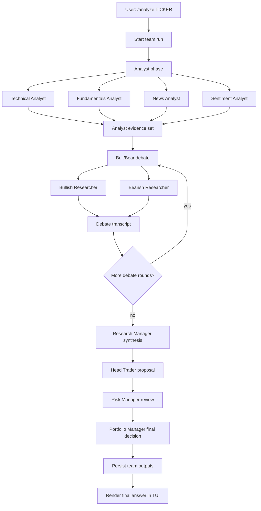
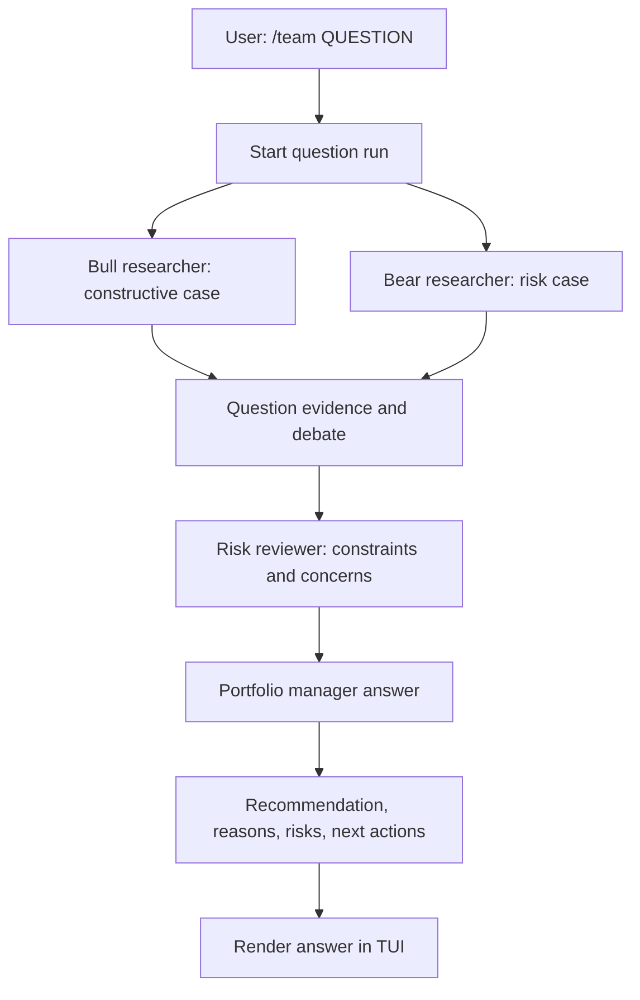
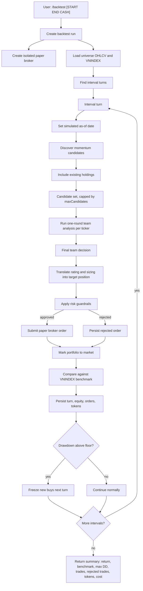
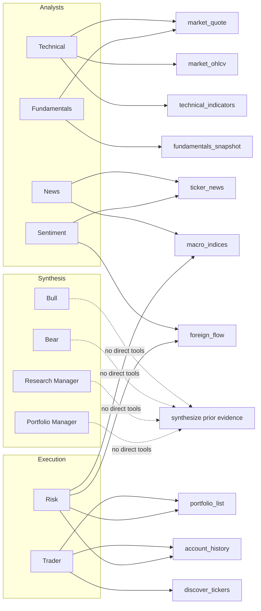

# Azoth Agent Team

Azoth's agent team is a Vietnam-equity adaptation of the multi-agent trading
desk pattern popularized by
[TauricResearch/TradingAgents](https://github.com/TauricResearch/TradingAgents).
TradingAgents models a real trading firm with specialized analysts, bull and
bear researchers, a trader, risk management, and portfolio approval. Azoth keeps
that role-driven workflow, but implements it as a terminal-native TypeScript
application built on the Claude Agent SDK, local MCP tools, SQLite persistence,
and broker-aware risk controls.

Azoth does not vendor TradingAgents code. The relationship is architectural:
TradingAgents is the reference design for the multi-agent investment workflow;
Azoth reworks that design for Vietnam market data, local-first state, and the
Azoth TUI.

## Upstream Model

TradingAgents describes a multi-agent trading framework that mirrors the
structure of a trading firm:

- Analyst team: fundamentals, sentiment, news, and technical analysis.
- Researcher team: bullish and bearish researchers debate the analyst evidence.
- Trader agent: turns the research into a trading decision.
- Risk management and portfolio manager: evaluate risk, adjust the proposal,
  and approve or reject the transaction.

The upstream project also emphasizes persistence and recovery through a
decision log and checkpoint resume. Azoth uses the same general idea of
durable runtime state, but stores role outputs, broker state, team runs, and
session logs in the local Azoth SQLite runtime.

## Azoth Team Roles

Azoth's structured single-ticker analysis uses these roles:

| Phase | Role | Purpose |
| --- | --- | --- |
| Analyst | Technical Analyst | Reads quote, OHLCV, RSI, MACD, SMA, support, resistance, trend, and volatility. |
| Analyst | Fundamentals Analyst | Reviews valuation and quality metrics such as P/E, P/B, ROE, EPS, and market cap. |
| Analyst | News Analyst | Reviews company news and macro index backdrop for catalysts and risks. |
| Analyst | Sentiment Analyst | Uses news tone and foreign-flow pressure as Vietnam-market sentiment proxies. |
| Debate | Bullish Researcher | Builds the strongest constructive case from analyst evidence. |
| Debate | Bearish Researcher | Builds the strongest avoid, reduce, or sell case from analyst evidence. |
| Synthesis | Research Manager | Weighs the debate and produces a clear investment plan. |
| Execution | Head Trader | Converts the research plan into rating, sizing, entry band, and exit plan. |
| Control | Risk Manager | Applies concentration, macro, liquidity, market-session, and guardrail concerns. |
| Final | Portfolio Manager | Produces the final rating, allocation, rationale, and exit plan. |

Azoth uses a five-tier rating scale:

- `Buy`
- `Overweight`
- `Hold`
- `Underweight`
- `Sell`

Sizing is normalized as a portfolio NAV fraction from `0` to `1`, so `0.04`
means a 4% position.

## Execution Flow

For `/analyze <ticker>`, Azoth runs the team in phases:



```text
single ticker
  -> technical, fundamentals, news, sentiment analysts run in parallel
  -> bull and bear debate for N rounds
  -> research manager synthesizes a plan
  -> trader sizes the idea and proposes an entry/exit view
  -> risk manager approves, rejects, or adjusts sizing
  -> portfolio manager writes the final recommendation
  -> Azoth persists role outputs locally
```

For `/team <question>`, Azoth uses a lighter question-oriented flow:



```text
portfolio or market question
  -> bull researcher frames the constructive case
  -> bear researcher frames the risk case
  -> risk reviewer checks constraints and major concerns
  -> portfolio manager returns an answer, recommendation, reasons, risks, and next actions
```

The top-level chat agent can also route automatically:

- Simple quote, news, or portfolio requests call direct tools.
- Broad allocation or portfolio questions call the team question flow.
- Deep single-ticker buy, sell, hold, or sizing requests call the team analysis
  flow.

## Backtesting With The Agent Team

Azoth's `/backtest` command reuses the same team analysis engine in replay
mode. Instead of asking the team to analyze one live ticker, the backtest runner
walks through historical interval closes, discovers candidates, runs the team
on each candidate as of that historical timestamp, converts final decisions into
paper broker orders, and records the resulting equity curve. The default
interval is 30 minutes; `/backtest --interval 1h` or `--interval 2h` can be used
to slow the replay cadence.



The backtest loop has several important constraints:

- The active clock is pinned to each historical interval close, so market tools
  do not see future bars.
- When no date range is supplied, `/backtest` uses the previous calendar week.
- The strategy makes decisions one configured interval at a time. It does not
  batch the whole day or week into one decision.
- Team prompts and operating rules treat Vietnam listed equity settlement as
  T+2 and prohibit same-day round trips.
- Candidate discovery can scan listed equities or a caller-provided ticker
  basket; backtests use the default liquid universe to keep replay cost bounded.
- Each candidate receives a one-round team analysis to keep replay cost bounded.
- Web search is disabled during backtests so historical turns rely on Azoth's
  market data and cached/local tools rather than current open-web context.
- The paper broker uses the historical close as the fill reference through a
  price override.
- Orders still pass guardrails before they are filled. Guardrail-blocked orders
  are persisted as rejected broker orders.
- Position targets are capped by both the backtest max position limit and the
  configured risk max position percentage.
- If mark-to-market drawdown breaches the backtest floor, new buy orders are
  frozen on the next turn.

Backtest persistence uses the same local SQLite runtime:

- `backtest_runs` stores strategy name, start/end dates, initial cash, universe,
  model, broker name, interval, candidate limit, and risk settings.
- `backtest_turns` stores the prompt, team response summary, token usage, and
  cost for each historical interval turn.
- `backtest_equity` stores cash, mark-to-market equity, and benchmark equity.
- Broker tables store paper orders, fills, rejects, positions, and cash.
- Team-run tables store the role outputs generated during candidate analysis.

The final summary reports total return, VNINDEX benchmark return, max drawdown,
filled trades, rejected trades, token usage, and estimated model cost.

## Tool Boundaries

Azoth constrains tools by role. Each role receives only the tools it needs:



| Role | Allowed tools |
| --- | --- |
| Technical | `market_quote`, `market_ohlcv`, `technical_indicators` |
| Fundamentals | `fundamentals_snapshot`, `market_quote` |
| News | `ticker_news`, `macro_indices` |
| Sentiment | `ticker_news`, `foreign_flow` |
| Bull, Bear, Research Manager | No direct tools; synthesize prior evidence. |
| Trader | `portfolio_list`, `account_history`, `discover_tickers` |
| Risk | `portfolio_list`, `account_history`, `macro_indices`, `foreign_flow` |
| Portfolio | No direct tools; final synthesis. |

This differs from a free-form agent that can call every tool at any time. The
goal is to keep each role accountable for a narrow part of the decision process
and make outputs easier to audit.

## Vietnam Market Adaptation

Azoth specializes the TradingAgents pattern for Vietnam equities:

- Prices are treated as thousand VND, matching common DNSE and SSI quote
  conventions.
- Tickers are normalized to uppercase Vietnam-market symbols.
- Settlement guidance is Vietnam-specific and avoids assuming same-day
  round-trips.
- Sentiment uses practical local proxies: company/news tone and foreign flow.
- Data tools target DNSE public chart data, SSI iBoard quotes, VNDirect Finfo
  fundamentals, CafeF news, macro index data, and foreign-flow context.
- Broker workflows account for HOSE lot sizing, paper trading, optional DNSE
  live trading, autonomy mode, and risk gates.

## Persistence

Azoth writes team activity to local SQLite:

- Team run start and completion metadata.
- Role outputs and usage details.
- Final team recommendations.
- Broker orders, fills, rejects, cash, and positions.
- Project session logs for TUI resume.

The default runtime path is `~/.azoth`, unless `AZOTH_HOME`, `AZOTH_CONFIG`, or
`AZOTH_DB` override it.

## Safety Model

Azoth is designed for decision support first. Live trading remains explicitly
gated:

- `advisory` mode: research and recommendations only.
- `confirm` mode: user confirmation is required before order submission.
- `auto` mode: orders still pass risk guardrails.
- DNSE live trading requires explicit broker configuration and live-trading
  arming.
- Release validation and normal tests do not place live orders.

Risk review can reject or reduce trader sizing before the final portfolio
decision. Guardrails also enforce lot size, notional, concentration, cash,
market session, whitelist, drawdown, and daily-loss constraints where
configured.

## Design Differences From TradingAgents

| Area | TradingAgents | Azoth |
| --- | --- | --- |
| Runtime | Python package and CLI | TypeScript package and Ink TUI |
| Orchestration | LangGraph-based trading graph | Claude Agent SDK roles with local MCP tools |
| Market focus | General stock-market research framework | Vietnam equities and DNSE/SSI/VNDirect/CafeF data |
| UI | Interactive CLI screens | Chat-first terminal workspace |
| Persistence | Decision log and checkpoint resume | SQLite cache, broker records, team runs, and session logs |
| Execution | Simulated exchange flow in framework | Paper broker plus optional DNSE live broker adapter |
| Safety | Research framework warning and portfolio approval | Explicit autonomy modes, broker arming, and runtime guardrails |

## References

- [TauricResearch/TradingAgents](https://github.com/TauricResearch/TradingAgents)
- [TradingAgents arXiv paper](https://arxiv.org/abs/2412.20138)
